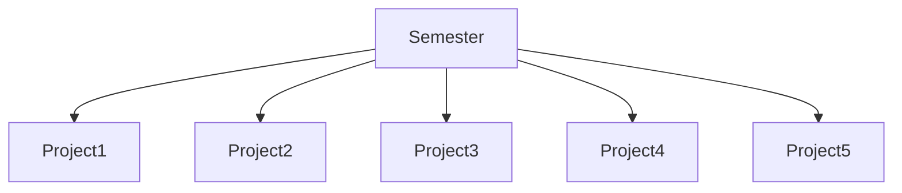

# CMPG-323-Overview---35551178
Will be consisting of all the information that is needed to do project 1 to 5

## Repositories
-> Repository for Agile and Scrum implentation project: CMPG-323-Overview---35551178 \
-> Repository for API Development project: CMPG-323-Project-2--35551178 \
-> Repository for Patterns and Standards project: CMPG-323-Project-3--35551178 \
-> Repository for Testing and RPA project: CMPG-323-Project-4--35551178 \
-> Repository for Reporting and Monitoring project: CMPG-323-Project-5--35551178

## Diagram explaining how the project will be broken down

## Branching Strategy
-> GitHub Flow Strategy. It focuses on Agile principles and so it is a fast and streamlined branching strategy with short production cycles and frequent releases, also allows for fast feedback loops so that one can quickly identify issues and resolve them.

## .gitignore file
-> the .gitignore file gonna list the names of files that can be found in work-trees when working in the project, but that should not be committed to the project (e.g sensitive information about the user) 

## Storage of credentials and sensitive information
-> They will be encypted and stored in a gitignore file which will not be commit to githib to avoid licks 
